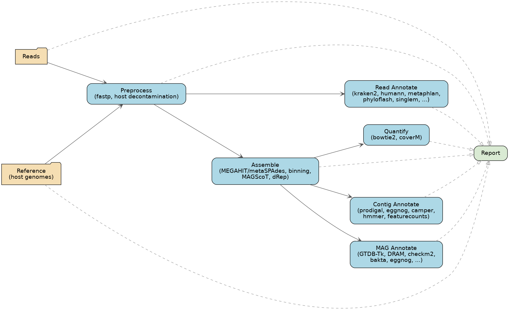
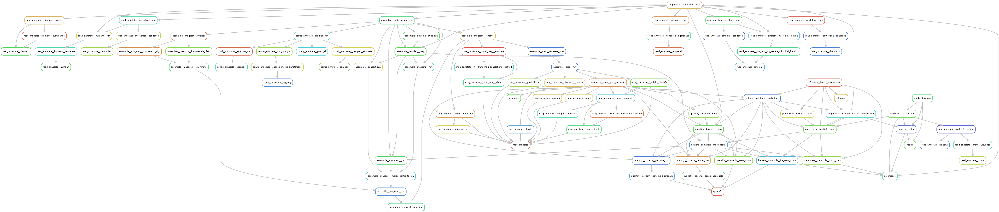

> **This is a modified fork**, maintained for running this pipeline on **Kelvin2, the HPC cluster at Queen's University Belfast**. It diverges from the upstream [`fischuu/Snakebite-Holoruminant-MetaG`](https://github.com/fischuu/Snakebite-Holoruminant-MetaG) pipeline (and its own upstream, [`3d-omics/mg_assembly`](https://github.com/3d-omics/mg_assembly)) with a Kelvin2-specific SLURM profile (`config/profiles/Kelvin/`), recalibrated per-rule resource tiers, a project bootstrap script (`workflow/scripts/bootstrap_project.sh`), and a shared, group-writable container image cache. If you're not running on Kelvin2 at QUB, the upstream repository is very likely what you want instead.
>
> **New here? Start with [docs/00-Kelvin2-Quickstart.md](docs/00-Kelvin2-Quickstart.md)** (setup) **and [docs/01-Kelvin2-Walkthrough-ReadsToMAGs.md](docs/01-Kelvin2-Walkthrough-ReadsToMAGs.md)** (a worked, step-by-step example: raw reads to MAGs).

# Overview


This Snakemake pipeline dedicated to Metagenomic data analysis consists out of several modules that
cover a) read-based b) contig-based and c) MAG-based analyses as well as quantification, quality
checks and a reporting module (which is currently under development). Naturally, it runs seamlessly
on HPC systems and all required software tools are bundled in docker container and/or conda
environments. Further, all required databases are pre-configured and ready to be downloaded from a
central place.

This makes it straight forward and as user-friendly as it can get.

The pipeline is organised in modules, which can run one-by-one. Further, the user can also choose to
run individual tools, giving full flexibility on how to use and run the pipeline.



A higher-level view of the same thing: the major modules and how they feed into each other.
Hand-drawn (`flowchart/module_overview.dot`), but every edge was verified against real
cross-module references in `workflow/rules/` rather than assumed — see
`flowchart/render_module_overview.sh` to regenerate after a real structural change.



The full detail behind that: the real rule-dependency graph of this fork's current
`workflow/rules/`, generated with Snakemake's own `--rulegraph` (see
`flowchart/generate_rulegraph.sh`) rather than hand-drawn, so it can't drift out of sync
with the actual rules. It's far more granular (raw rule names) than the module view above —
see that script's header comment for how to regenerate it and the caveats involved.

# Running this fork on Kelvin2

**Full walkthrough: [docs/00-Kelvin2-Quickstart.md](docs/00-Kelvin2-Quickstart.md)** — prerequisites,
cloning, bootstrapping a project, launching, how the resource-tier system works, and known
limitations. Start there; this section is just the condensed version.

**Worked example, raw reads to MAGs: [docs/01-Kelvin2-Walkthrough-ReadsToMAGs.md](docs/01-Kelvin2-Walkthrough-ReadsToMAGs.md)**
— a concrete, step-by-step run through preprocessing, assembly, binning, and dereplication,
including exactly what to expect from the two grouped rules along the way.

```bash
# 1. Clone your own copy (see the quickstart for why "your own")
git clone git@github.com:CreeveyLab/Pipeline-Holoruminant-Meta.git

# 2. Scaffold a new project from your real reads
Pipeline-Holoruminant-Meta/workflow/scripts/bootstrap_project.sh <project_dir> \
  --reads-dir <directory with your *_R1_*/*_R2_*.fastq.gz files>

# 3. Launch
cd <project_dir>
bash run_Kelvin.sh
```

`bootstrap_project.sh` wires your project up to the shared, central reference-genome/database
store and container cache automatically — you shouldn't need to download or configure either
yourself.

# Installation, Setup and running the pipeline (upstream, generic)

The guides below are the **original, generic** upstream documentation — useful for understanding
the pipeline's modules and options in general, but they don't cover anything Kelvin2-specific
(the Kelvin SLURM profile, `bootstrap_project.sh`, resource tiers, or the shared stores this fork
sets up for you). For running on Kelvin2, use the quickstart above instead.

Guide to install the pipeline: [Installation](https://github.com/fischuu/Pipeline-Holoruminant-Meta/blob/main/docs/02-Installation.md)

Guide to prepare the configuration files: [Setup](https://github.com/fischuu/Pipeline-Holoruminant-Meta/blob/main/docs/03-Setup.md)

Guide for running the pipeline: [Usage](https://github.com/fischuu/Pipeline-Holoruminant-Meta/blob/main/docs/04-Usage.md)

Information for additional tools: [Extra](https://github.com/fischuu/Pipeline-Holoruminant-Meta/blob/main/docs/05-Extra.md)

For troubleshooting, please visit the collection of most common errors: [Troubleshooting](https://github.com/fischuu/Pipeline-Holoruminant-Meta/blob/main/docs/10-Troubleshooting.md)


# Contributions

List of contributing authors:
...


# Contact
Please use the issue tracker from the GitHub or contact one of the contributors, if you'd prefer personal contact.


## References

- [`fastp`](https://github.com/OpenGene/fastp)
- [`kraken2`](https://github.com/DerrickWood/kraken2)
- [`SingleM`](https://github.com/wwood/singlem)
- [`Nonpareil`](https://github.com/lmrodriguezr/nonpareil)
- [`bowtie2`](https://github.com/BenLangmead/bowtie2)
- [`samtools`](https://github.com/samtools/samtools)
- [`MEGAHIT`](https://github.com/voutcn/megahit)
- [`CONCOCT`](https://github.com/BinPro/CONCOCT)
- [`MaxBin2`](http://downloads.jbei.org/data/microbial_communities/MaxBin/MaxBin.html)
- [`MetaBat2`](https://bitbucket.org/berkeleylab/metabat)
- [`MAGScoT`](https://github.com/ikmb/MAGScoT)
- [`dRep`](https://github.com/MrOlm/drep)
- [`QUAST`](https://github.com/ablab/quast)
- [`GTDB-TK`](https://github.com/Ecogenomics/GTDBTk)
- [`DRAM`](https://github.com/WrightonLabCSU/DRAM)
- [`CoverM`](https://github.com/wwood/CoverM)
- [`FastQC`](https://github.com/s-andrews/FastQC)
- [`multiqc`](https://github.com/ewels/MultiQC)
- [`NCyc`](https://github.com/qichao1984/NCyc)


# Acknowledgements
This pipeline is a fork from the Snakemake workflow

https://github.com/3d-omics/mg_assembly/

and tailored and extended to the needs of the Holoruminant project.
