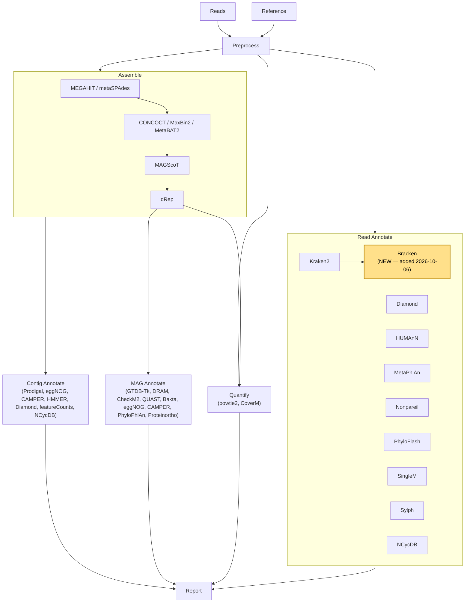

# Overview
This Snakemake pipeline dedicated to Metagenomic data analysis consists out of several modules that
cover a) read-based b) contig-based and c) MAG-based analyses as well as quantification, quality
checks and a reporting module (which is currently under development). Naturally, it runs seamlessly
on HPC systems and all required software tools are bundled in docker container and/or conda
environments. Further, all required databases are pre-configured and ready to be downloaded from a
central place.

This makes it straight forward and as user-friendly as it can get.

The pipeline is organised in modules, which can run one-by-one. Further, the user can also choose to
run individual tools, giving full flexibility on how to use and run the pipeline.

## Flow diagram

The diagram below reflects **this fork's** actual module structure, not the
upstream project's own flowchart image — the two have genuinely diverged
(see `CLAUDE.md` Section 1 for the full history: `annotate` split into
`mag_annotate`/`read_annotate`, a new `devel` module, and the Kelvin2-specific
resource-tiering system). It's redrawn here, rather than linked as a static
image, so it can be kept in sync with the real rule graph going forward —
see `docs/02-Kelvin2-Rule-Reference.md` for the exact rule name behind every
node.

**Bracken is a new addition to this pipeline** (2026-10-06, highlighted
above): it runs Bayesian abundance correction on each sample's Kraken2
report — Kraken2's own raw report over-represents higher taxonomic ranks,
and correcting it with Bracken alongside it is standard practice. See
`workflow/rules/read_annotate/bracken.smk` and
`config/features.yaml`'s `bracken_kmer_distrib:` block.

